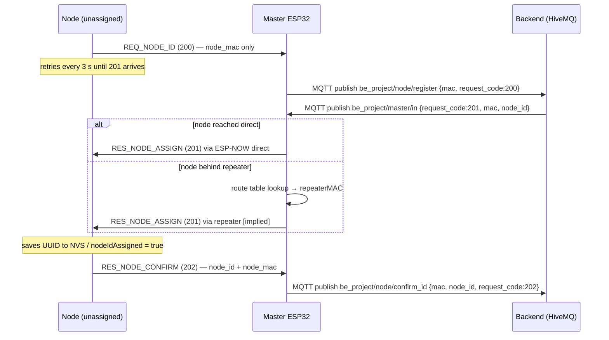
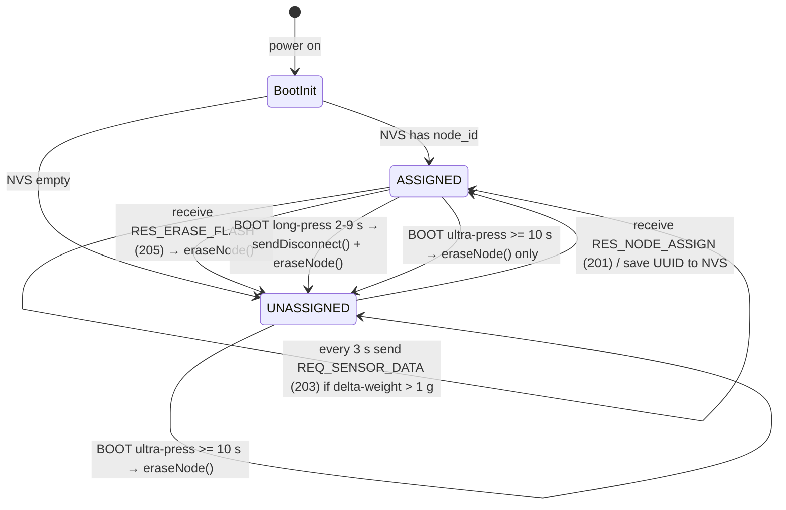
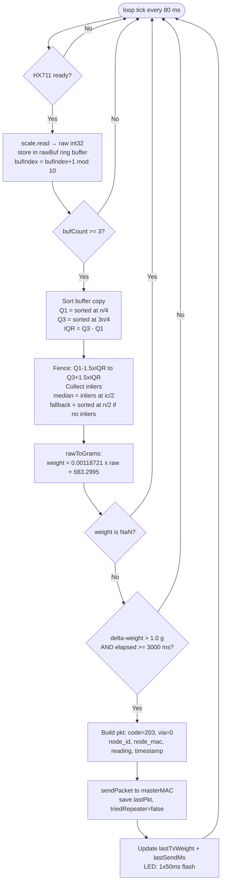
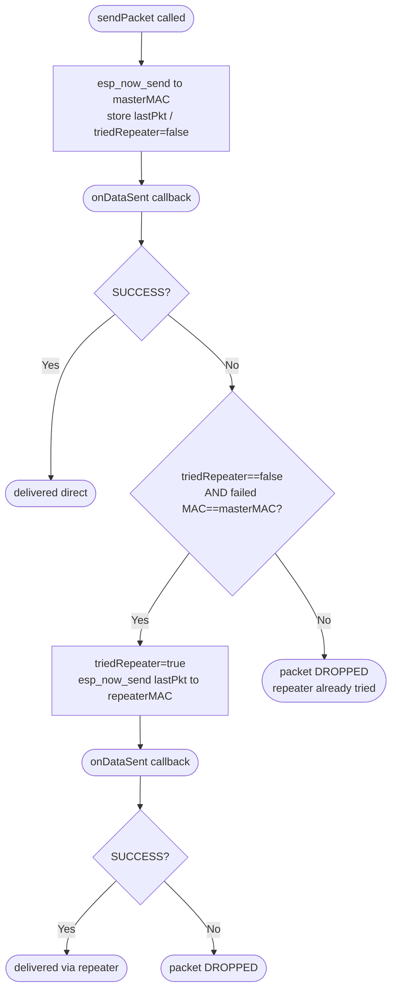
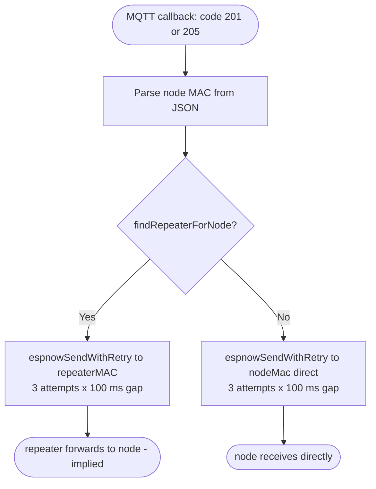

# FluidCare Firmware Reference

**Files read:** `node.cpp`, `master.cpp`, `calibration.cpp`, `platformio.ini`  
**Dead-code/ excluded.** Items implied but not coded marked **[implied]**.

---

## 1. ESP-NOW Packet Structure

Both node and master define identical `sensor_data_t`. Sent as raw bytes via `esp_now_send`.

| # | Field | C type | Size | Meaning |
|---|-------|--------|------|---------|
| 1 | `request_code` | `uint16_t` | 2 B | Protocol code 200–207 |
| 2 | `node_id` | `char[37]` | 37 B | UUID assigned by backend; null-terminated |
| 3 | `node_mac` | `char[18]` | 18 B | Node MAC `"XX:XX:XX:XX:XX:XX"`; null-terminated |
| 4 | `reading` | `float` | 4 B | IQR-filtered weight in grams |
| 5 | `timestamp` | `uint32_t` | 4 B | `millis()/1000` — seconds since node boot (not wall-clock) |
| 6 | `date_str` | `char[11]` | 11 B | `"YYYY-MM-DD"` — in struct; **never written by node.cpp; always `""`** |
| 7 | `time_str` | `char[9]` | 9 B | `"HH:MM:SS"` — in struct; **never written by node.cpp; always `""`** |
| 8 | `via` | `uint8_t` | 1 B | `0` = direct to master; `1` = relayed through repeater |
| 9 | `repeater_mac` | `char[18]` | 18 B | Repeater MAC string — **never written by node.cpp; filled by repeater [implied]** |
| 10 | `master_mac` | `char[18]` | 18 B | Master MAC string — **never written anywhere in current firmware** |

Sources: `node.cpp:53-65`, `master.cpp:112-124`

---

## 2. Protocol Codes

| Code | Name | Direction | What it triggers |
|------|------|-----------|-----------------|
| 200 | `REQ_NODE_ID` | node → master | Node requests UUID; master publishes to `be_project/node/register` |
| 201 | `RES_NODE_ASSIGN` | master → node | Backend UUID forwarded via ESP-NOW; node saves NVS, sends 202 |
| 202 | `RES_NODE_CONFIRM` | node → master | Node confirms UUID saved; master publishes to `be_project/node/confirm_id` |
| 203 | `REQ_SENSOR_DATA` | node → master | Weight reading; master enqueues for MQTT publish to `be_project/node/data` |
| 204 | `REQ_TASK_COMPLETE` | node → master | Task-done; master publishes to `be_project/node/task_complete` — **master.cpp only; node.cpp never sends** |
| 205 | `RES_ERASE_FLASH` | master → node | Backend-commanded NVS erase; node clears NVS, sends 206 |
| 206 | `RES_ERASE_CONFIRM` | node → master | NVS erased; master publishes to `be_project/node/erase_confirm` |
| 207 | `REQ_DISCONNECT` | node → master | Node going offline; master publishes to `be_project/disconnect` |

Sources: `node.cpp:43-50`, `master.cpp:38-46`

---

## 3. ID-Assignment Handshake

Sources: `node.cpp:195-214`, `node.cpp:282-310`, `master.cpp:461-518`, `master.cpp:573-637`

---

## 4. Node State Machine

### Boot Sequence (`setup()`)

| Step | Action | Source |
|------|--------|--------|
| 1 | Serial 115200, 1 s delay | `node.cpp:390-392` |
| 2 | Pin modes: `LED_PIN` OUTPUT low; `BUTTON_PIN` INPUT_PULLUP | `node.cpp:394-396` |
| 3 | Read NVS `"node_cfg"/"node_id"` → if non-empty: ASSIGNED state | `node.cpp:398-406` |
| 4 | `WiFi.mode(WIFI_STA)`, `WiFi.setSleep(false)`, channel 6 | `node.cpp:408-416` |
| 5 | Read own MAC → `nodeMac[]` string | `node.cpp:418-421` |
| 6 | `esp_now_init()` — restart on failure | `node.cpp:427-430` |
| 7 | Register `onDataRecv` + `onDataSent` callbacks | `node.cpp:431-432` |
| 8 | Add master peer (ch 6, no encryption) | `node.cpp:434-439` |
| 9 | Add repeater peer (ch 6, no encryption) | `node.cpp:441-446` |
| 10 | `scale.begin(DOUT=4, SCK=5)` | `node.cpp:448` |
| 11 | If UNASSIGNED: `requestNodeId()` immediately | `node.cpp:451-452` |

### Main-Loop Cadence (`loop()`, 80 ms tick)

| Order | Call | Condition |
|-------|------|-----------|
| 1 | `handleButton()` | Always |
| 2 | `sampleLoadCell()` | Always |
| 3 | `updateStatusLed()` | Always |
| 4 | `requestNodeId()` | UNASSIGNED AND >= 3000 ms since last request |
| 5 | `sendSensorData()` | ASSIGNED AND >= 3000 ms since last send |
| 6 | `delay(80)` | Always |

Source: `node.cpp:457-471`

---

## 5. Button Rules

### Node — BOOT button (GPIO0, active LOW)

| Hold duration | Action | State requirement |
|--------------|--------|-------------------|
| < 2000 ms | Ignored | Any |
| 2000–9999 ms | `sendDisconnect()` (207) then `eraseNode()` | ASSIGNED only; UNASSIGNED: ignored |
| >= 10 000 ms | `eraseNode()` only — no 207 sent | Any |

> `DISCONNECT_BTN_PIN` (GPIO13) is `#define`d at `node.cpp:23` but **never read** — not implemented.

Source: `node.cpp:341-385`

### Master — BOOT button (GPIO0, active LOW, 50 ms debounce)

| Event | Action |
|-------|--------|
| Falling edge | Advance display page `(page + 1) % 4`; reset 7 s auto-rotate timer |

Source: `master.cpp:287-313`

---

## 6. LED Status Patterns

### Node LED (GPIO2)

| Pattern | Trigger |
|---------|---------|
| 1 x 50 ms ON | Sensor data sent (203) — `sendSensorData()` |
| 1 x 150 ms ON | ID request sent (200) — `requestNodeId()` |
| 3 x 80 ms ON / 80 ms gap | ID received (201) or ID confirmed (202) |
| 5 x 60 ms ON / 60 ms gap | NVS erase (205 or ultra-press) — `eraseNode()` |
| 3 x 300 ms ON / 100 ms gap | Disconnect sent (207) — `sendDisconnect()` |
| 2 x 50 ms ON / 50 ms gap | Send failed — `onDataSent()` FAIL path |
| Toggle every 300 ms | UNASSIGNED heartbeat — `updateStatusLed()` |
| Toggle every 2000 ms | ASSIGNED idle heartbeat — `updateStatusLed()` |

Source: `node.cpp:100-133`

### Master LED (GPIO2)

LED is **solid ON** when MQTT connected. Activity shown as brief OFF "dips".

| Pattern | Trigger |
|---------|---------|
| Solid ON | MQTT connected — `connectMQTT()` |
| 300 ms blink | WiFi connecting — `connectWiFi()` |
| 1 x 30 ms dip | Sensor data received (203) |
| 1 x 50 ms dip | ID confirm received (202) |
| 2 x 50 ms dip | Register (200) or task-complete (204) received |
| 2 x 100 ms dip | Disconnect received (207) |
| 3 x 80 ms dip | Erase confirm received (206) |
| 3 x 50 ms ON flash | MQTT publish failed |

Source: `master.cpp:197-243`, dip calls in `master.cpp:573-699`

---

## 7. Sensing Pipeline

Sources: `node.cpp:168-238`

---

## 8. Reliability / Failover Path

One repeater retry per original send. Source: `node.cpp:312-339`

### Master Downlink Routing

### Route Table (`storeRoute`, `master.cpp:148-181`)

- Populated when `data.via == 1` arrives in `onDataRecv`.
- Key: `node_mac` string. Value: `repeater_mac[6]` bytes.
- Max 10 entries. First-write-wins per node MAC — no updates.
- `repeaterCount` tracks unique repeater MACs for LCD page 0.

### FreeRTOS Queue (`master.cpp:126-128`)

203 packets pushed from ESP-NOW callback (WiFi task) → `mqttQueue` depth 10.  
Main loop drains → MQTT publish. Overflow: packet dropped with serial warning.

---

## 9. Tunable Constants

| Constant | Value | File:line | Role |
|----------|-------|-----------|------|
| `WIFI_CHANNEL` | `6` | `node.cpp:26` | ESP-NOW channel; must match master hotspot |
| `HX711_DOUT_PIN` | `4` | `node.cpp:20` | HX711 data GPIO |
| `HX711_SCK_PIN` | `5` | `node.cpp:21` | HX711 clock GPIO |
| `BUTTON_PIN` | `0` | `node.cpp:22`, `master.cpp:35` | BOOT button (active LOW) |
| `DISCONNECT_BTN_PIN` | `13` | `node.cpp:23` | Dedicated disconnect GPIO — **defined, never read** |
| `LED_PIN` | `2` | `node.cpp:24`, `master.cpp:34` | Status LED GPIO |
| `CALIB_M` | `0.00118721` | `node.cpp:30` | Calibration slope (g per ADC count) |
| `CALIB_B` | `683.2995` | `node.cpp:31` | Calibration offset (g) |
| `ROLLING_BUF_SIZE` | `10` | `node.cpp:34` | Circular sample buffer depth |
| `TRANSMIT_DELTA_G` | `1.0` | `node.cpp:35` | Min weight change (g) to trigger send |
| `SEND_INTERVAL_MS` | `3000` | `node.cpp:38` | Min inter-send interval (ms) |
| `IDLE_SLEEP_MS` | `80` | `node.cpp:39` | Loop delay / sample cadence (ms) |
| `LONG_PRESS_MS` | `2000` | `node.cpp:40` | Button disconnect threshold (ms) |
| `ERASE_PRESS_MS` | `10000` | `node.cpp:345` | Button erase threshold (ms) |
| `NODE_ID_RETRY_MS` | `3000` | `node.cpp:41` | REQ_NODE_ID retry interval while unassigned (ms) |
| `MAX_NODES` | `10` | `master.cpp:131` | Max ESP-NOW peers tracked |
| `MAX_ROUTED_NODES` | `10` | `master.cpp:137` | Max node→repeater route entries |
| `QUEUE_SIZE` | `10` | `master.cpp:127` | FreeRTOS sensor-data queue depth |
| `MQTT_PORT` | `8883` | `master.cpp:29` | HiveMQ TLS port |
| `masterMAC` | `6C:C8:40:35:58:C8` | `node.cpp:71` | Hardcoded master board MAC |
| `repeaterMAC` | `A4:F0:0F:61:8E:F4` | `node.cpp:76` | Hardcoded repeater fallback MAC |
| Master loop delay | `30` ms | `master.cpp:814` | Master main-loop cadence |
| LCD I2C clock | `100 000` Hz | `master.cpp:716` | 100 kHz for PCF8574 reliability |

---

## 10. MQTT Topic Map

| Topic | Direction | Payload fields | Triggered by |
|-------|-----------|---------------|-------------|
| `be_project/master/in` | backend → master (subscribed) | `{request_code, mac, [node_id]}` | Backend sends 201 or 205 |
| `be_project/node/register` | master → backend | `{mac, request_code:200}` | Master receives 200 |
| `be_project/node/confirm_id` | master → backend | `{mac, node_id, request_code:202}` | Master receives 202 |
| `be_project/node/data` | master → backend | `{request_code, node_id, node_mac, reading, timestamp}` | Queue drain of 203 packets |
| `be_project/node/task_complete` | master → backend | `{mac, node_id, request_code:204}` | Master receives 204 |
| `be_project/node/erase_confirm` | master → backend | `{mac, request_code:206}` | Master receives 206 |
| `be_project/disconnect` | master → backend | `{mac, node_id, request_code:207}` | Master receives 207 |

Source: `master.cpp:48-55`, `master.cpp:573-699`

---

## 11. Open / Could Not Verify

| Item | Status |
|------|--------|
| Repeater firmware (`repeater.cpp`) | **Missing from repo.** Referenced in `node.cpp:69-70` comments. `via`, `repeater_mac`, and master route-table logic all assume relay device exists; its implementation is unknown. |
| `date_str` / `time_str` population | **Not implemented.** Fields in struct; no code writes them. Always `""` on wire. |
| `master_mac` field | **Not implemented.** In struct; never written anywhere. |
| `DISCONNECT_BTN_PIN` GPIO13 | **Not implemented.** Defined at `node.cpp:23`; `handleButton()` never reads it. |
| `REQ_TASK_COMPLETE` (204) sender | **Not in node.cpp.** Master handles receipt; no node-side send path in current firmware. |
| `calibration.cpp` | Standalone raw CSV data-collection sketch. Excluded from build via `platformio.ini` source filter `+<*> -<calibration.cpp>`. Not deployed firmware. |

---

*Generated from: `node.cpp`, `master.cpp`, `calibration.cpp`, `platformio.ini`*
