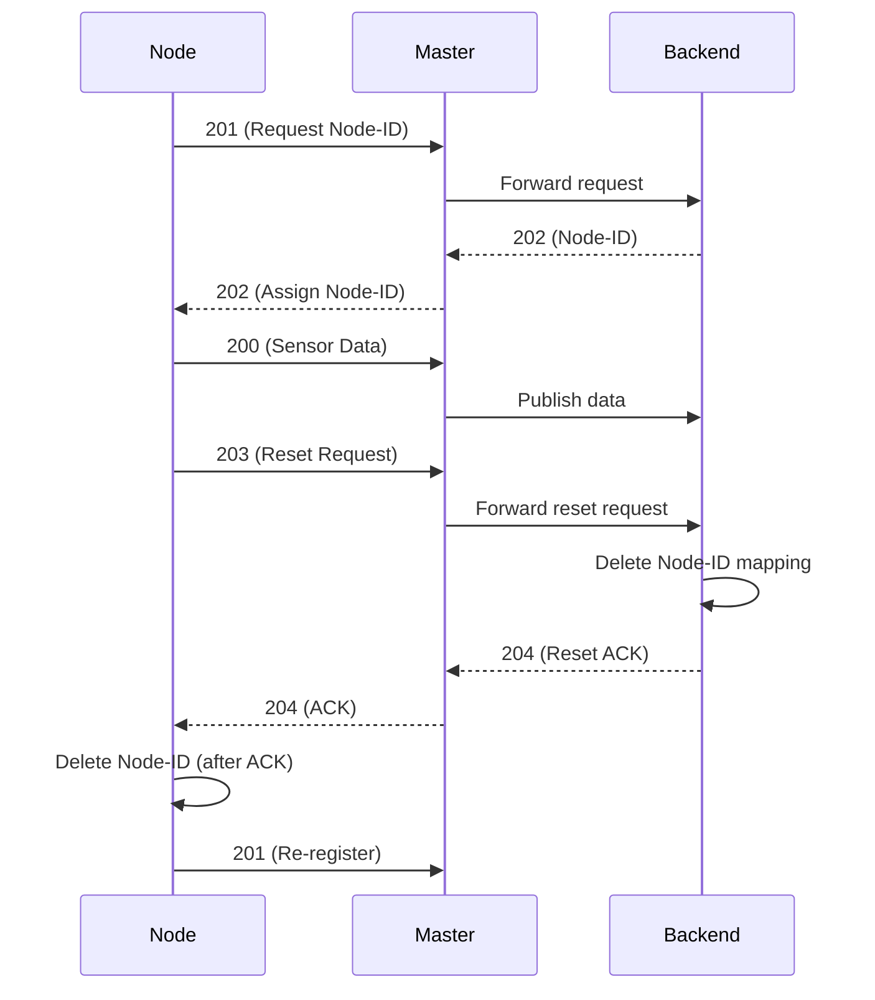

# 📘 Firmware Guideline: Node Reset Flow (203 / 204)

## 🎯 Objective

Introduce a **safe deregistration mechanism** for nodes using a **request–acknowledgement model**.

* **203 → Reset Request**
* **204 → Reset Acknowledgement**

This ensures synchronization between **Node, Master, and Backend**.

---

# 🔢 Status Code Summary

| Code    | Direction     | Description           |
| ------- | ------------- | --------------------- |
| 200     | Node → Master | Sensor data           |
| 201     | Node → Master | Request Node-ID       |
| 202     | Master → Node | Node-ID assigned      |
| **203** | Node → Master | Request Node reset    |
| **204** | Master → Node | Reset confirmed (ACK) |

---

# ⚙️ Existing Firmware Flow

### 1. Registration

* Node sends **201**
* Master forwards to backend
* Backend responds with **202**
* Node stores Node-ID (persistent)

---

### 2. Data Transmission

* Node periodically sends **200**
* Master forwards to backend (MQTT)

---

# 🔴 New Reset Flow (Firmware Perspective)

### Step-by-step behavior:

### 1. Trigger

* Reset is initiated via **physical button press**

---

### 2. Node Action

* Node sends **203 (Reset Request)** to Master
* Node **must retain Node-ID** at this stage

---

### 3. Master Action

* Receives **203**
* Extracts Node MAC
* Forwards request to backend via MQTT

---

### 4. Backend Action (Overview)

* Identifies node using MAC
* Deletes Node-ID mapping
* Marks node as **unregistered**
* Sends **204 (ACK)**

---

### 5. Master Action

* Receives **204**
* Routes ACK to correct node via ESP-NOW

---

### 6. Node Final Action

* On receiving **204**:

  * Deletes Node-ID from persistent storage
  * Resets internal state
  * Returns to **unregistered state**

---

# ⚠️ Mandatory Firmware Rules

## 1. ACK-Based Deletion (Critical)

* Node **must NOT delete Node-ID on 203**
* Deletion is allowed **only after receiving 204**

---

## 2. MAC-Based Identification

* All communication must rely on **Node MAC**
* Do not depend on Node-ID for routing

---

## 3. Retry Mechanism

* If **204 is not received**:

  * Node should retry sending **203** periodically
* Prevent deadlock state

---

## 4. State Transition

| State           | Description                |
| --------------- | -------------------------- |
| Registered      | Node has valid Node-ID     |
| Reset Requested | 203 sent, waiting for ACK  |
| Unregistered    | After 204, Node-ID cleared |

---

## 5. User Interaction Safety

* Reset should ideally be triggered via:

  * **Long press (2–3 seconds)**
* Prevent accidental resets

---

## 6. Master Role (Firmware Constraint)

* Master acts as:

  * **Transport bridge only**
* Must NOT:

  * Store business logic
  * Modify reset decisions

---

# 🧠 Backend Overview (For Firmware Awareness)

Firmware team only needs to know:

* Backend listens for **203**
* Uses **MAC address** to:

  * Identify node
  * Delete Node-ID mapping
* Sends **204** after successful deletion

👉 Backend is the **source of truth**

---

# 🔄 System Flow Diagram (Mermaid)



---

# 🔍 How to Get a Device's MAC Address

Every board prints its own MAC on the Serial Monitor at boot. Routing
(`masterMAC`, `repeaterMAC` in [node.cpp](node.cpp)) depends on these
values, so read them before flashing nodes.

### Steps

1. Flash the sketch to the board (`node.cpp` / `repeater.cpp` / master sketch).
2. Open the **Serial Monitor** in Arduino IDE (`Tools → Serial Monitor`).
3. Set baud rate to **115200**.
4. Press the board's **RESET** button.
5. Read the MAC printed at boot, e.g.:

   ```
   📟 Node MAC: A1:B2:C3:D4:E5:F6
   ```

### Standalone Sketch (Print MAC Only)

Flash this minimal sketch to any ESP32 board to read its STA MAC — no
firmware logic, just the address.

```cpp
#include <WiFi.h>
#include <esp_wifi.h>

void setup() {
  Serial.begin(115200);
  delay(500);

  WiFi.mode(WIFI_STA);          // ESP-NOW uses the STA interface

  uint8_t mac[6];
  esp_wifi_get_mac(WIFI_IF_STA, mac);

  Serial.printf("Device MAC (STA): %02X:%02X:%02X:%02X:%02X:%02X\n",
                mac[0], mac[1], mac[2], mac[3], mac[4], mac[5]);
}

void loop() {
  // nothing — MAC already printed at boot
}
```

Copy the printed value into `masterMAC[]` / `repeaterMAC[]` in
[node.cpp](node.cpp) as a byte array:

```cpp
// Serial: 6C:C8:40:35:58:C8
uint8_t masterMAC[] = {0x6C, 0xC8, 0x40, 0x35, 0x58, 0xC8};
```

---

### Order of Operations

* **Master** — flash first, note its MAC. Put it in `masterMAC[]` in [node.cpp](node.cpp).
* **Repeater** — flash next, note its MAC. Put it in `repeaterMAC[]` for nodes behind it.
* **Node** — direct-to-master nodes target `masterMAC`; nodes behind a repeater target `repeaterMAC`.

### MAC Format

* 6 bytes, hex: `A1:B2:C3:D4:E5:F6`
* In code as byte array: `{0xA1, 0xB2, 0xC3, 0xD4, 0xE5, 0xF6}`
* Uses the **STA (station) interface** MAC (`esp_wifi_get_mac(WIFI_IF_STA, ...)`)

> ⚠️ ESP boards have separate STA and AP MACs. ESP-NOW routing uses the **STA**
> MAC — always copy the one printed by the firmware, not the one on the chip label.

---

# 🚀 Final Summary

* **203** → Initiates reset (Node → Backend)
* **204** → Confirms reset (Backend → Node)
* Node deletes identity **only after 204**
* System remains consistent across all layers
